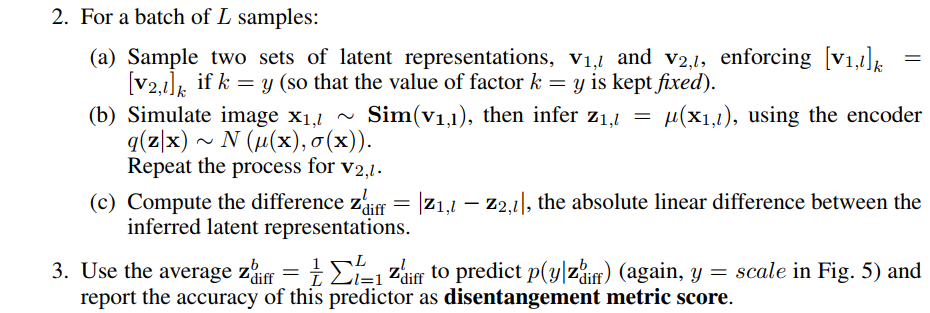
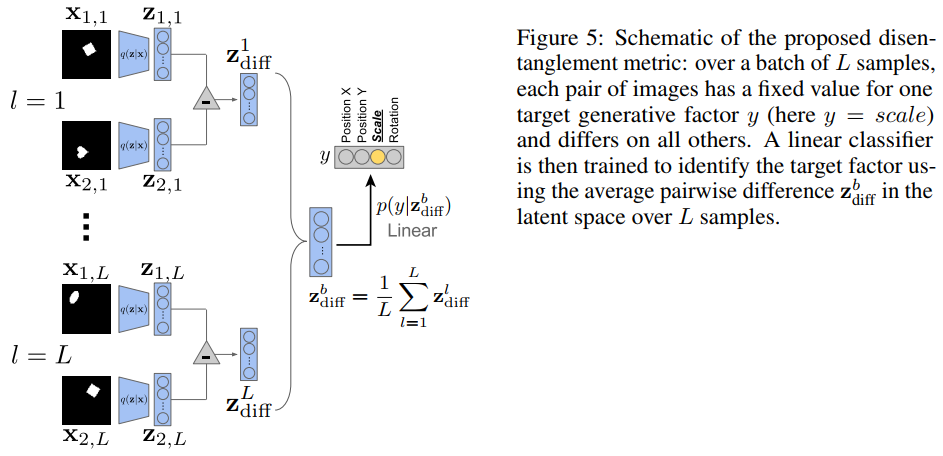
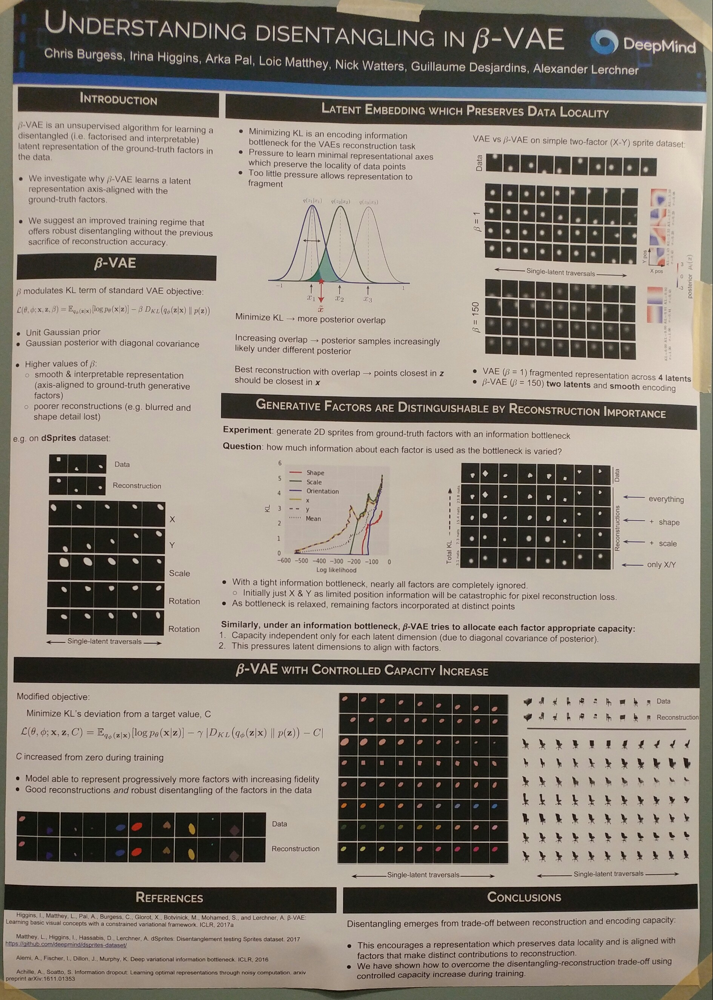

# $\beta$-VAE: Learning Basic Visual Concepts with a Constrained Variational Framework
### by Irina Higgins, Loic Matthey, Arka Pal, Christopher Burgess, Xavier Glorot, Matthew Botvinick, Shakir Mohamed, Alexander Lerchner (DeepMind fellows)
### ICLR 2017 (OpenReview: 2016-11)

This paper presented $\beta$-VAE, a modification (generalization?) of variational autoencoders and made it available to enforce to learn more *"disentangled"* representations. The method is very simple and, omitting all the derivations, can be seen from this one (loss) equation.

Where $\beta=1$ corresponds to the original VAE formualation. Since the KL divergence term enforces the inferred latent factors $q_{\phi}(z|x)$ match to the prior $p(z) = N(0,I)$ (which is an isotropic unit Gaussian), if $\beta > 1$, this loss pulls the latent variables to have more factorized, disentangled property. However, there is a tradeoff between the disentanglement quality and the reconstruction fidelity. (The authors also interpret $\beta$ as the capacity of the latent channel bottleneck.) Due to this tradeoff, the authors argue that the log likelihood of the data under the latent model is a poor metric for measuring the disentangling factors, and they propose a new evaluation metric for it.

The proposed disentanglement metric is calculated as below:

The authors chose a linear classifier with low VC-dimension in order to ensure it has no capacity to perform nonlinear disentagling by itself.

Some questions:
- Why do we need to *measure* how much *disentanglement* is achieved?
  - I personally cannot think of its usefulness right now..
- **Disentanglement** is good at understanding what the model is doing in *human's* point of view, but I think achieving **independence** of variables is the better way to go - maybe let's call it a *machine's* point of view for disentanglement. That's why I don't really agree at this another proposed metric, since by looking at the formulation, $\beta$-VAE is also just trying to achieve near-independence of variables.
- Maybe I am just a bit confused about the detailed differences in these terminologies: disentanglement, independence, factorization, ...

There are extensive experiments in this original paper, but more analysis is done by the follow-up workshop paper:

# Understanding disentangling in $\beta$-VAE
### by Christopher P. Burgess, Irina Higgins, Arka Pal, Loic Matthey, Nick Watters, Guillaume Desjardins, Alexander Lerchner (almost the same as the above)
## NIPS 2017 workshop on Learning Disentangled Representations

I'll substitute the explanations and details with the photo of this self-contained poster that I took at NIPS 2017.

Some comments
- Experiment with controlled capacity increase was quite interesting. The paper shows many ways of doing experiements - maybe we can refer to the methods when we do some ablation studies ourselves.
- I was very excited about $\beta$-VAE line of work at first glance, but somehow getting a bit more and more disappointed because the problem setting seems to be too simple. However, keep thinking about how to use this for better learning and interpretation.

--
> Jan. 17, 2018
> Note by Myungsub
