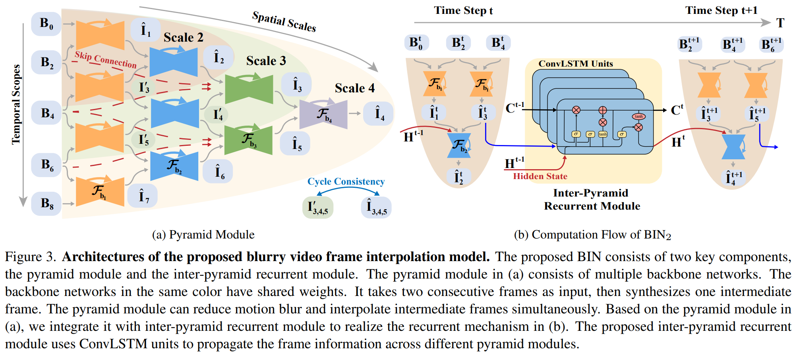
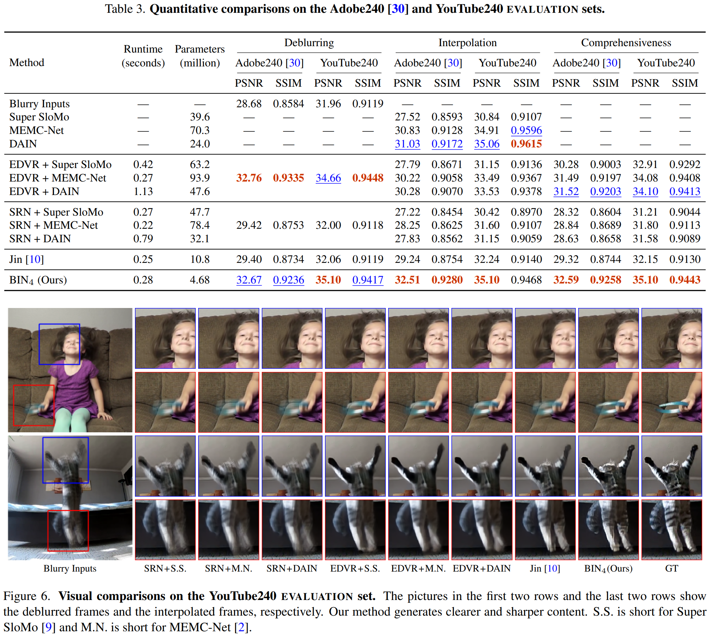

# Blurry Video Frame Interpolation
### by Wang Shen, Wenbo Bao, Guangtao Zhai, Li Chen, Xiongkuo Min, and Zhiyong Gao
### CVPR 2020

Like the previous work [[1](./flawless-slomo.md)], this paper aims to generate sharp interpolations given the blurry low frame-rate video.
To this end, the authors designed a new architecture that performs well on many cases.

#### Advantages

- Multiple new design choices (for this application, at least) such as multi-scale pyramid modules, cyclic loss, and inter-pyramid recurrent module for temporal consistency
- Experimental results are quite impressive

#### Disadvantages

- Fixed backbone network which cannot generate arbitrary number of intermediate frames
- Complicated architecture which may need a lot of tuning to train; should check the [code](https://github.com/laomao0/BIN) to see whether it really trains in 2 days as written in the paper

### Method

The main contribution of this paper is definitely the architectural choices.
They use multiple residual dense network as the backbone, and the model parameters are shared for the same scale.
In total, they use 4 scales, and the intermediate outputs are used for cycle consistency loss.
Along the temporal axis, inter-pyramid recurrent module using convolutional LSTM handles the time steps, as illustrated below.

Training is done with a pixel reconstruction loss and cycle consistency losses.
They use Adobe240 dataset, and average 11 sharp frames to generate the blurry frame.

### Results

Quantitative and qualitative results both look good.
We can see that EDVR is good at video deblurring, but BIN with 4 scales is also very competitive, and performs much better than existing SOTA interpolation approaches.

This paper also compares motion smoothness, and shows that BIN is much better than other methods handling videos.
Overall, since there is only one prior work by [Jin *et al.*](./flawless-slomo.md) that jointly handles deblurring and frame interpolation, this work shows a nice empirical improvement.

--
> Aug. 24, 2020
> Note by Myungsub
