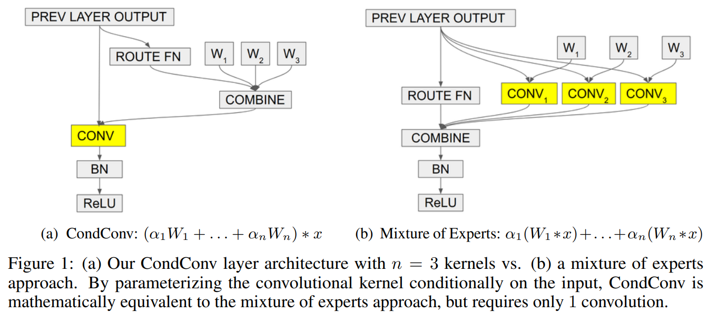
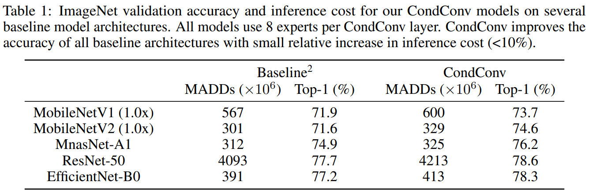
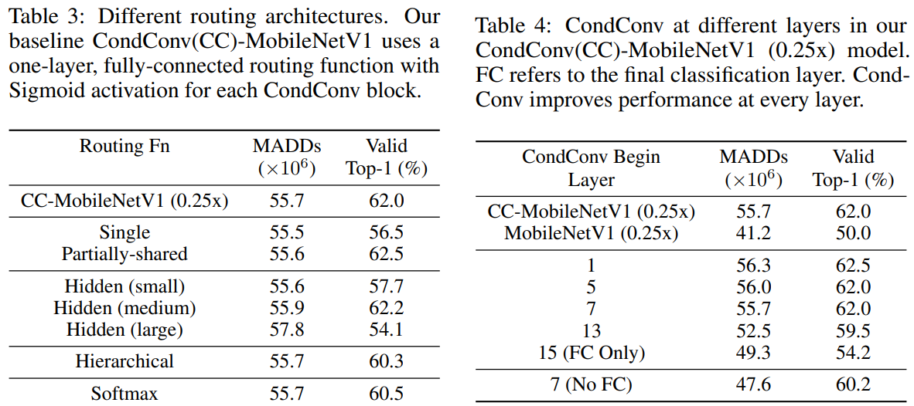
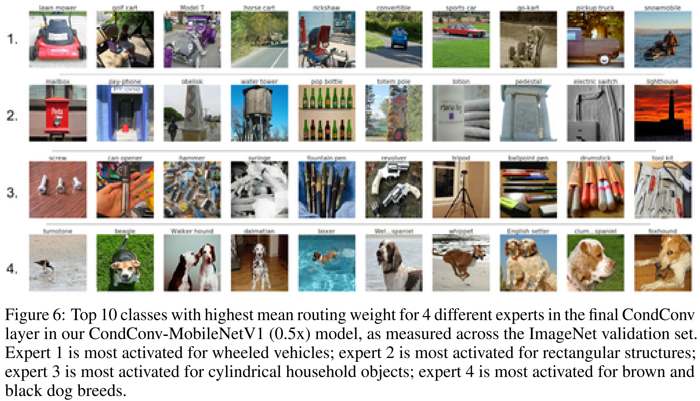

# CondConv: Conditionally Parameterized Convolutions for Efficient Inference
### by Brandon Yang, Gabriel Bender, Quoc V. Le, and Jiquan Ngiam
### NeurIPS 2019

This paper proposes an input-adaptive convolution methodology that is mathematically the same as mixture-of-experts but is much more efficient.
The proposed CondConv can replace convolution layers, and shows quite significant performance improvement with small amount of additional computation (even shows small performance improvement with less computation).

#### Advantages

- Simple and effective method that can work as a drop-in replacement of original convolutions
- State-of-the-art performance and thorough ablation studies

#### Disadvantages

- Pre-defined number of experts (although this issue is not at all critical)
- Follow-up works show that the performance and efficiency can be further improved...

### Method

The method is very simple and can be summarized as below:

$ Output(x) = \sigma((\alpha_1 \cdot W_1 + ... + \alpha_n \cdot W_n) * x) $

where each $\alpha_i = r_i (x)$ is an input-dependent scalar weight computed by a routing function.
This per-example routing function is also designed to be computationally efficient, and the authors define it as:

$r(x) = Sigmoid(GlobalAveragePool(x) R)$

where $R$ is a matrix of learned routing weights mapping the pooled inputs to $n$ expert weights.

### Results

ImageNet classification results:

Ablation studies on the effect of routing architectures and how many convolution layers to replace with CondConv:

Visualizations of what kind of semantically meaningful features each expert focuses on:

--
> Aug. 24, 2020
> Note by Myungsub
