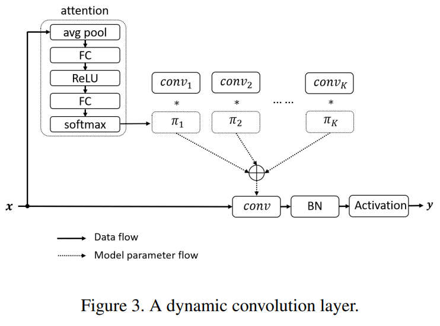
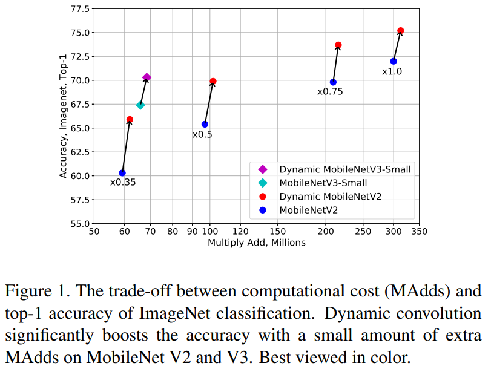
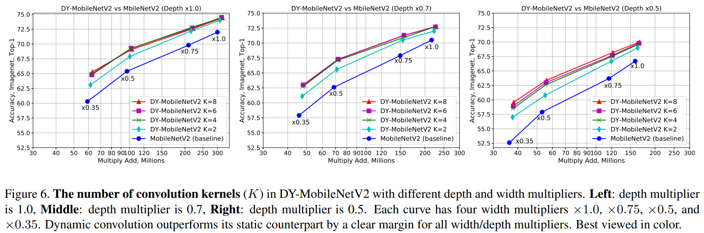
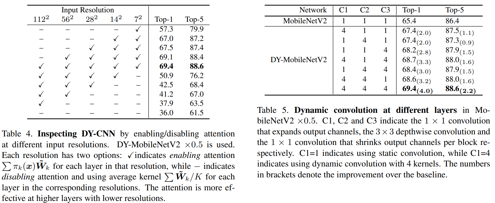

# Dynamic Convolutions: Attention over Convolution Kernels
### by Yinpeng Chen, Xiyang Dai, Mengchen Liu, Dongdong Chen, Lu Yuan, and Zicheng Liu
### CVPR 2020

This paper is a concurrent work to [CondConv](./condconv.md), with almost the same methodology.
However, the results are quite better, and the authors claim that it is due to their two additional training tricks: summing the attention to one, and giving near-uniform attention in early epochs.

#### Advantages

- Same as CondConv; simple and effective method with good results

#### Disadvantages

- The number of parameters usually become about x4 larger to achieve good performance gain, although the multiply-adds does not increase that much (~10%)

### Method

The dynamic convolution operation illustrated below summarizes the method:

They also introduce two training tricks for training dynamic CNNs.
First is to make the sum of the attention to one (which is quite natural), by using softmax.
Second is to make the attention weights near-uniform in early training epochs, which is done by giving the temperature to the softmax function.

### Results

Performance improvements shown in Figure 1 of the paper:

ImageNet classification results with MobileNetV2:

Ablation study shows that using dynamic convolution in all layers shows the best performance.
This seems natural since it also increases the number of parameters. Though the multiply-adds does not increase that much, the model with dynamic convolution *includes* the original model, so the performance *should* increase.

--
> Aug. 24, 2020
> Note by Myungsub
