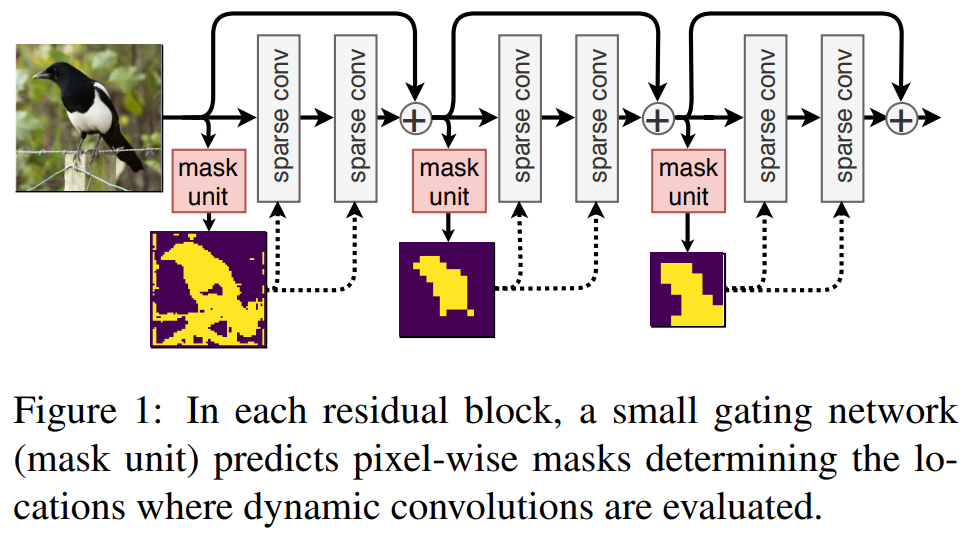
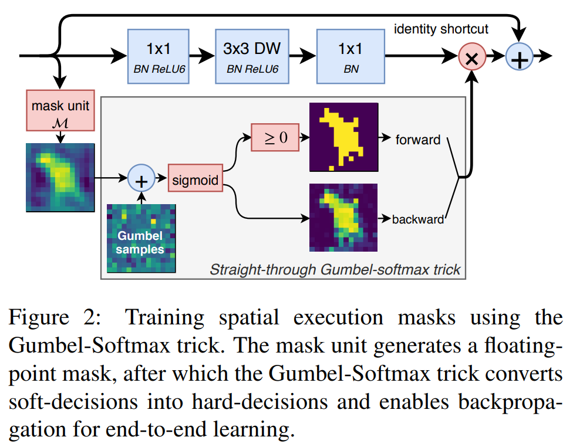
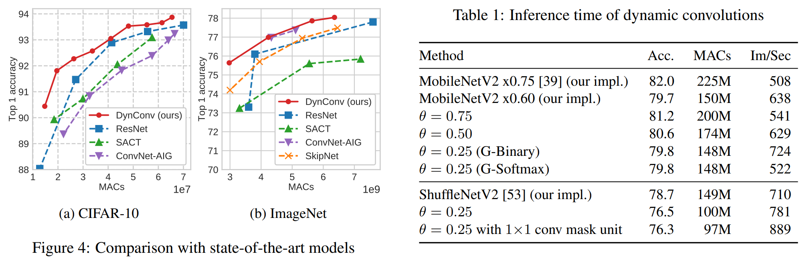
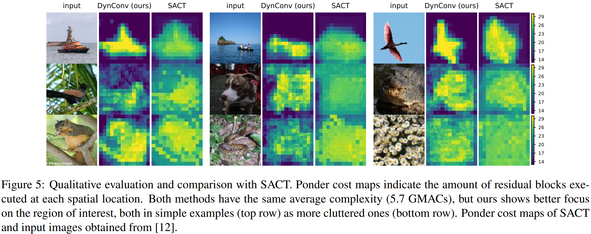

# Dynamic Convolutions: Exploiting Spatial Sparsity for Faster Inference
### by Thomas Verelst and Tinne Tuytelaars
### CVPR 2020

This paper proposes dynamic convolution over spatial dimensions, which reduces the computational complexity by convolving only over (dynamically-generated) masked regions.

#### Advantages

- Nice and intuitive architecture and methods - the paper includes many technical contributions that has been previously not considered well (*e.g.* Gumbel-Softmax for spatial masking operation)
- Public CUDA implementation is available to easily apply it to different applications

#### Disadvantages

- Performance drop looks quite severe regarding the amount of computational cost saved

### Method

The basic concept of the proposed model looks like the figure below:

To decide the hard attention masks for each residual block, a small gating network is introduced to generate the mask in an input-adaptive way.
Then, the generated soft mask is used for the backward pass, while it is quantized for the forward pass.
This makes it almost the same as the straight-through estimator of [Bengio *et al.*](https://arxiv.org/abs/1308.3432), except that the soft samples are approximated using a Gumbel-Softmax trick.

For inference, the generated hard (quantized) mask is dilated with a morphological transformation to handle 3x3 convolutions.

**Sparsity loss.**

Since the model will use all spatial positions without any constraints, the authors give a computational budget on FLOPS as the additional loss terms.
However, just constraining the computation globally can make training very unstable, because some layers might use all or none of the spatial position and cannot recover.
Thus, the authors use an idea of giving per-layer computational constraints.
Since it can limit the flexibility of the model too much, the authors instead constrain the upper and lower bound of the computation for each layer.

The final loss then becomes:

$ \mathcal{L} = \mathcal{L}_{task} + \alpha ( \mathcal{L}_{sp,net} + \mathcal{L}_{sp,lower} + \mathcal{L}_{sp,upper} ) $

where the global sparsity constraint and the per-layer sparsity lower / upper bound constraints are added.

### Results

CIFAR-10 and ImageNet classification results:

Given the same computation budget, DynConv performs the best.
However, making the existing network (MobileNetV2) more efficient with DynConv degrades the performance (as expected).
It seems like the performance degradation is quite large, given the small improvement in efficiency.
My personal thought is that this is because the object of interest in CIFAR-10 or ImageNet classification constitutes a large portion of the image region, making the generated mask not that sparse.
Perhaps applying this technique to different applications where the foreground object is small could have better presented the effectiveness of this work.

The generated mask is illustrated below. The visualization is intuitive, focusing well on the important objects.

--
> Aug. 24, 2020
> Note by Myungsub
