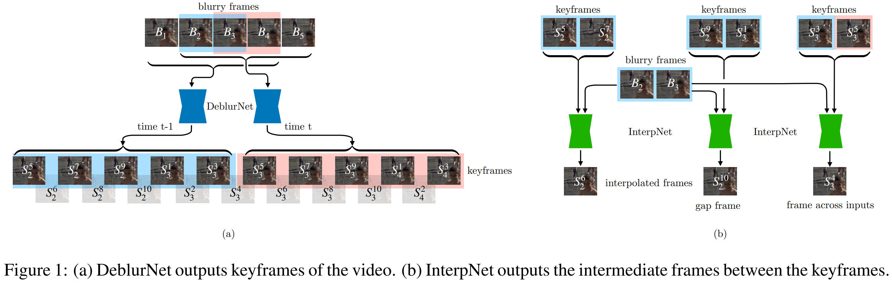
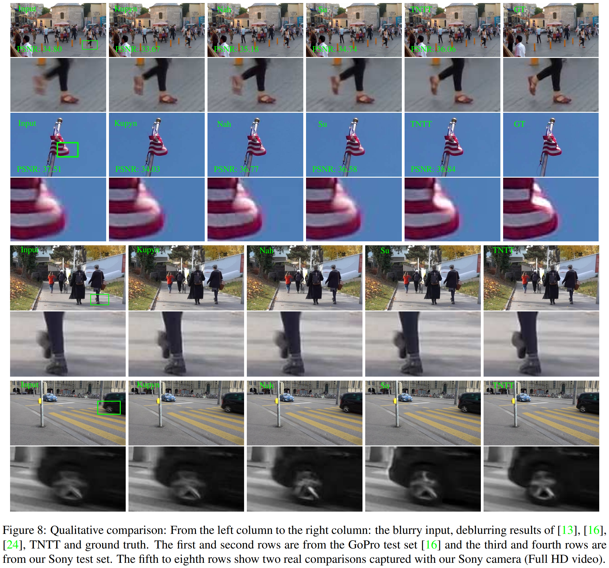

# Learning to Extract Flawless Slow Motion from Blurry Videos
### by Meiguang Jin, Zhe He, and Paolo Favaro
### CVPR 2019

This paper aims to generate the interpolations that are *sharp*, using the intermediate motion information that is contained in the blurry videos.
Since blurs are the result of an averaging process, it inherently contains the (temporally) local motion.

#### Advantages

- New problem formulation of combining deblurring and video frame interpolation
- New dataset captured with a Sony RX V camera
- Experimental result looks good

#### Disadvantages

- Assumption of fixed number of frames; can only generate x5, x10, x20, etc. slow-motion videos. Need training from scratch to change the interpolating ratio
- Complicated (and hard-coded w.r.t. frame indices) loss terms. Not sure why these processes are really needed at hindsight.

### Method

The authors decompose the process of obtaining sharp interpolations from blurry videos into two steps: 1) deblurring the blurry frames, and 2) interpolation with the sharp de-blurred frames.
Specifically, they make 5 sharp intermediate keyframes with DeblurNet, and use the sharp keyframes (and also the original blurry frames) to generate the originally-intended interpolations with InterpNet.

There are also some thoughtful choices on designing the framework written in this paper, but personally I think the problem setting (of using blurry frames to obtain sharp interpolations) is the most important part.
Other details on training and implementation can be found in the paper.

### Results

Both quantitative and qualitative results look good, although comparison with some more video frame interpolation methods would be more interesting (but standard frame interpolation methods do x2 slow motion, while this paper performs x5, which makes it difficult to compare - not really that difficult, but needs additional training from scratch).
However, given that this paper proposes a new joint problem of deblurring and interpolation, its novelty still remains.

--
> Aug. 23, 2020
> Note by Myungsub
