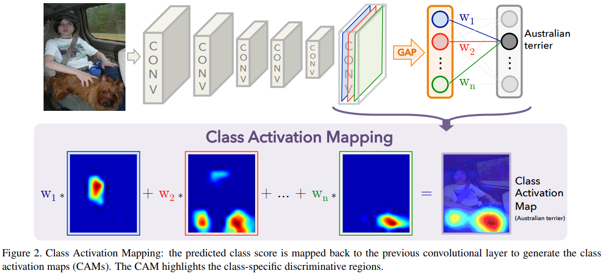
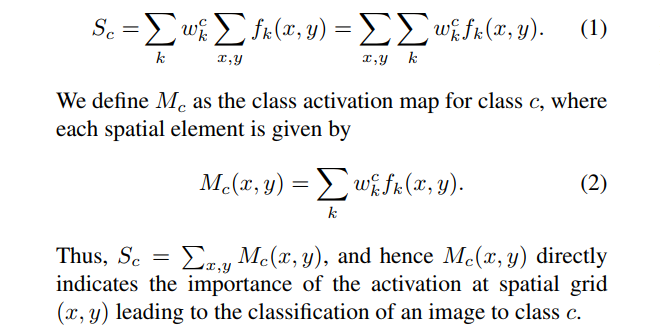
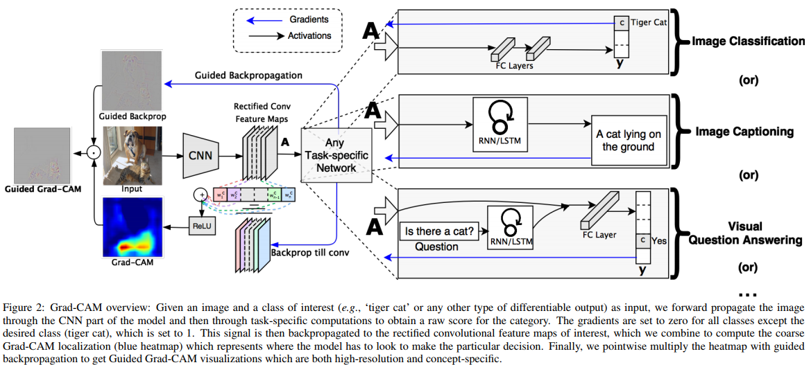
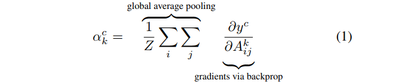
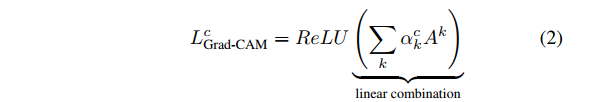
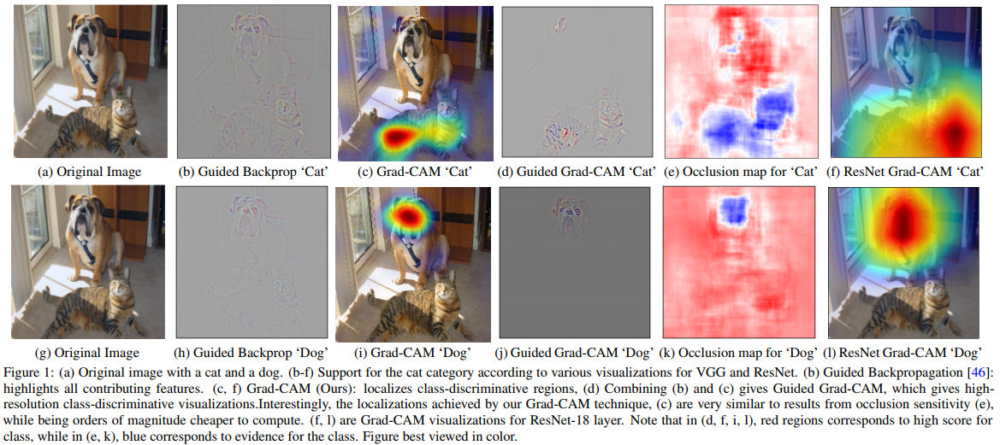

# CAM and Grad-CAM - Interpreting Activation Maps

## Learning Deep Features for Discriminative Localization
### Bolei Zhou, Aditya Khosla, Agata Lapedriza, Aude Oliva, Antonio Torralba (MIT)
### ArXiv:1512, CVPR 2016

Now almost a *classic* deep learning paper, this work from MIT proposes the method of generating *class activation maps* (**CAM**) using global average pooling in CNNs. It's a seminal paper in interpreting the behavior of CNNs in image classification task, and showing how CNN activation maps contain the localization information even if it's only trained with global image classes.

The method of obtaining CAM is quite clear from the figure below.

In equations, it looks like this:

Important stuffs from this paper:
- Global Average Pooling (GAP): the localization accuracy of the heatmaps comes from the adoptation of GAP instead of GMP (global max pooling). Although this method can be applied with GMP, then it will only visualize the *one most* discriminative part contributing to the classification softmax, whereas using GAP can visualize *all* discriminative parts. The results supportively show that using GAP and GMP are similar in classification accuracy, but GAP wins in localization problems.
- Weakly supervised object localization: by looking at the CAM heatmaps, we can naturally think of the weakly supervised localization task. Using CAM, we can train with only image-level labels and be able to localize each objects (not perfectly, but still), use the deep features for generic object localization, and even find informative objects or concepts in the scene.
- Interpreting CNNs: the original paper shows how we can interpret a simple VQA baseline (which just models VQA task as classification, I suppose). Also, we can visualize the class-specific units (the units that are most discriminative for each class) of a CNN, which is pretty interesting. The authors say that, *'we could infer that the CNN actually learns a bag of words, where each word is a disciminative class-specific unit. A combination of these units guides the CNN in classifying each image.'*

## Grad-CAM: Visual Explanations from Deep Networks via Gradient-based Localization
### Ramprasaath R. Selvaraju1, Michael Cogswell, Abhishek Das, Ramakrishna Vedantam, Devi Parikh, Dhruv Batra
### Authors from Virginia Tech and Georgia Institute of Technology
### ArXiv:1610, ICCV 2017

One year after CAM, a more improved and more general approach is proposed by VT/GIT group (who also works with FAIR quite a lot). Grad-CAM is better in that:
- It can be applied to **any** CNN-based network, not just an image classification network with a GAP and a fully-connected layer at the end. Theoretically, it is proved in the paper that Grad-CAM is a generalization of CAM.
- It has stronger discriminative ability. Therefore better interpretability, and better (weakly-supervised) localization of discriminative features.

### Grad-CAM

First the main figure, and then the equations.

The main difference is that Grad-CAM uses *gradients* as the weightings of the feature activations, instead of the softmax importance in CAM.

The weights $\alpha_k^c$ captures the 'importance' of feature map $k$ for a target class $c$. In the author's words, it represents a *partial linearization* of the deep network downstream from A.
 
To get the final *maps*, the forward activation maps are combined with the weights calculated above, and put through a ReLU to visualize only the parts that give *positive* influences. This is for localization purpose, and if you want to visualize which part of the map gives a negative influence, you can just change the ReLU symmetrically to only output the negative parts.

### Guided Grad-CAM

Although Grad-CAM visualizes the discriminative parts well, it should be of low resolution (or, put through many many layers almost till the end of the model) to maintain its discriminative power. To visualize which part of the image is important *in pixel level*, this paper also proposes "Guided Grad-CAM". The method is simple:
1. Backpropagate (Guided Backpropagation) to the original image to get the gradient map.
2. Calculate Grad-CAM to get the discriminative heatmaps.
3. Pointwise multiply the gradient map with the Grad-CAM output.

The results will look like this: (with comparison)

## My Thoughts

- CAM was mind-braking when it first came out, and Grad-CAM results are very impressive.
- This line of works kind of resonates with my personal interest, and I think it is a very useful and powerful tool in interpreting current CNN-based deep networks. Also, the code is very easy to use! [[original-torch](https://github.com/ramprs/grad-cam)] [[tensorflow](https://github.com/insikk/Grad-CAM-tensorflow)] [[keras](https://github.com/jacobgil/keras-grad-cam)] [[pytorch](https://github.com/jacobgil/pytorch-grad-cam)]
  - I think I might be using it in almost every model that I train.. (50% for fun and 50% for 'interpretation')
- There's also a [Grad-CAM++ paper](https://arxiv.org/pdf/1710.11063.pdf) that came out on ArXiv recently. Should read it in near future to see what has been improved.

---
> Jan. 24, 2018

> Note by Myungsub