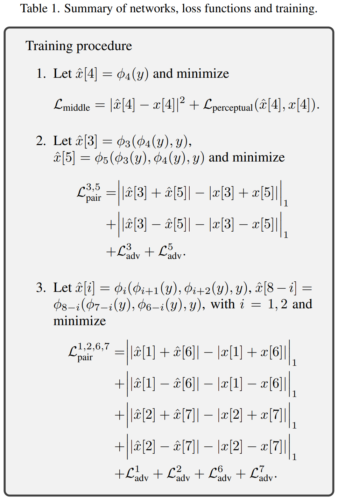
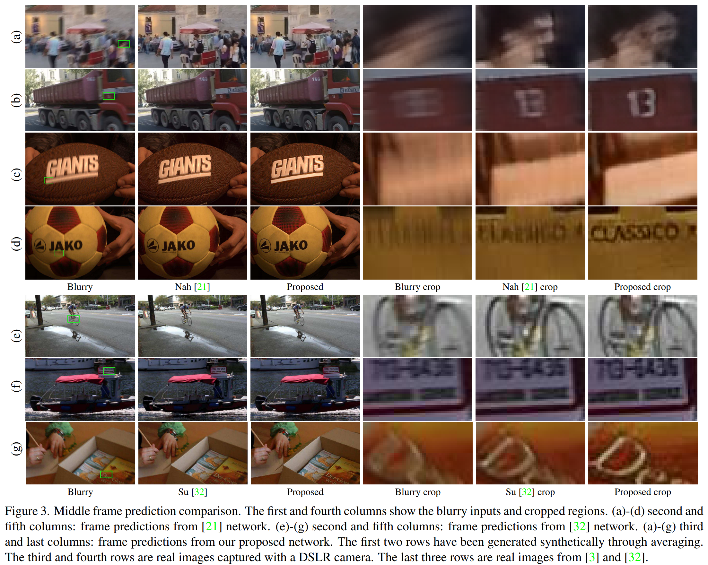
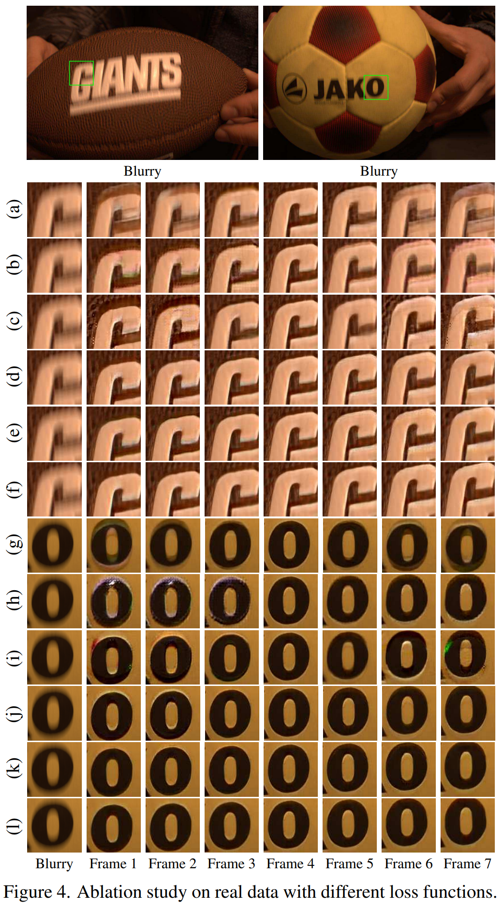
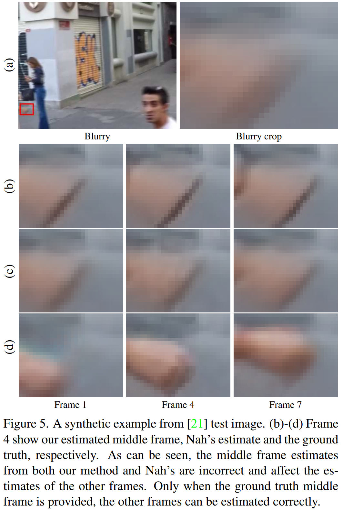

# Learning to Extract a Video Sequence from a Single Motion-Blurred Image
### by Meiguang Jin, Givi Meishvili, and Paolo Favaro
### CVPR 2018

A motion-blurred image is a result of an averaging process over time during the camera exposure.
This paper first proposes a method to invert this process, thus generating a video sequence from a single motion-blurred image.

#### Advantages

- New problem formulation
- Quite impressive visual results (due to adversarial loss?) and extensive ablation experiments

#### Disadvantages

- Assumption of fixed number of frames; they assume that the motion-blurred image is averaged from 7 frames, and explicitly generate 7 frames
- Although the problem itself is quite interesting, the framework can be greatly improved. At its current state (although there are many follow-up works that fixes this), the training procedure and the loss functions look very messy with lots of pre-defined hard-coded hyper-parameters. Also, the ablation study shows that their sequential training process cannot recover from errors in the first step and the erros propagate.

### Method

The authors design many different loss terms to resolve the temporal ordering ambiguities that can naturally appear when generating the video from a single image.
Denoting a network that predicts the frame $x\[i\]$ as $\phi_i$, they first train $\phi_4$ that predicts the middle frame, which does not have the temporal order ambiguity, using $L_1$ and perceptual loss.
For the other frames, they introduce the following losses:

1. Globally ordering-invariant loss: this is just an $L_1$ loss for each model predicting each frame at corresponding time steps ($t=1,2,3,5,6,7$)
2. Pairwise ordering-invariant loss: this is also $L_1$ loss terms, but the time steps are grouped to be invariant to the temporal order ($(\phi_i,\phi_{8-i}) for i=1,2,3$)

Finally, to decide the temporal ordering, they train the models sequentially.
Middle frame ($t=4$) first, neighboring frame ($t=3,5$) second, and far-away frames ($t=1,2,6,7$) the last.
This process is summarized below.

### Results

Visual results for the middle frame reconstruction (which is the same as the standard deblurring task, not really the contribution of this paper)

Frames for the other time steps are generated reasonably well, although the errors can propagate if the middle frame prediction is inaccurate.

--
> Aug. 23, 2020
> Note by Myungsub
