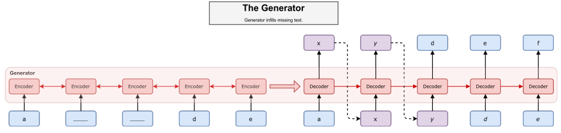
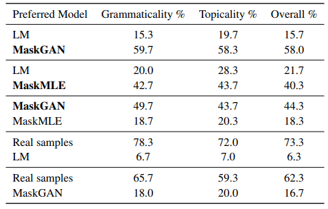

# MaskGAN: Better Text Generation via Filling in the ___________
### William Fedus, Ian Goodfellow, Andrew M. Dai
#### Google Brain
#### ICLR 2018 Poster, [arXiv:1801.07736](https://arxiv.org/abs/1801.07736)

### Outline
This paper (1) proposes to improve the text generation quality using Genrative Adversarial Network (GAN), which was successfully used in many image generation tasks and (2) claim that "validation perplexity" measure alone cannot be used to evaluate the quality of the generated text directly. Compared to conventional text generation models such as seq2seq where a word is sampled conditioned on the previous word, their model is based on a **actor-critic conditional GAN** that fills in missing text conditioned on the surrounding context. They show much natural & realistic results compared to conventional maximum-likelihood based models.

### Approach
Problem with previous text generation models is that - since they are trained to maximize the likelihood of a word conditioned on the previous word (*teacher-forcing*), model becomes unpredictable when an unseen word is used as a contdition to generate subsequent text, resulting in lower sample quality. There have been approaches to make the model more "predictable" (e.g. [professor-forcing](https://arxiv.org/abs/1610.09038), [SeqGAN](https://arxiv.org/abs/1609.05473)).

Since it is infeasable to propagate the gradients from the discriminator back to the generator in discrete text-generation setting, authors use **reinforcement learning (RL)** based approach to train the generator. Also, authors train the generator on "**in-filling**" task where the model is expected to complete an incomplete sentence with blanks. This setting provides more feedback (loss signals) to the generator, thus resulting in better training stability and less mode-collapse for the generator.

#### Network Architectures

**Generator:** A discrete sequence $\textbf{x}=\left( x_1,...,x_T \right)$ is masked element-wise as a masked sequence $\textbf{m}(\textbf{x})$, where some elements $x_t$ are replaced with a mask token $\left< m \right>$. Then **seq2seq** architecture is used to encode this masked sequence, providing context information of the sequence. 

Figure - Generator architecture: Encoder reads in masked sequence (underscore represents masked word), then the decoder imputes missing tokens using hidden states. Dotted line represents sampling operation.

**Discriminator:** Same architecture as the generator is used for the discriminator. Discriminator outputs probability estimates of all elements $\tilde{x_t}$ being a "real" example. In their formulation, log of the discriminator estimates are regarded as the reward. $r_t = \textrm{log}D_{\phi}( \tilde{x} _ t | \tilde{x} _ {0:T}, \textbf{m}(\textbf{x}) )$

**Critic:** The critic network estimates the value function, which is the discounted sum of total rewards $R_t = \sum_{s=t}^{T}{\gamma^s r_s}$, where $\gamma$ is the discount factor.

#### Training

Since the model is not fully-differentiable due to the discrete sampling operations in the generator, for training, they estimate the gradient of the parameters via policy gradients. Using a variant of REINFORCE algorithm, generator gradient contribution for a *single* token $\hat{x} _ t$ is $\nabla _ \theta \mathbb{E} _ G[R_t] = (R_t - b_t)\nabla _ \theta \textrm{log} G_\theta ( \hat{x} _ t )$ where $b_t = V^G ( x_{1:t} )$, learned value function is used for baseline.

### Experiments

Table - Mechanical Turk blind evaluation between model pairs (trained on IMDB reviews)

MaskGAN represents GAN-trained variant and MaskMLE represents maximum-likelihood trained variant. Authors used PTB and IMDB dataset at word-level. Evaluation of generative models is done by unbiased human evaluation where blind comparison using Amazon Mechanical Turk is used.

---
> Jan. 31 2018, Janghoon Choi
