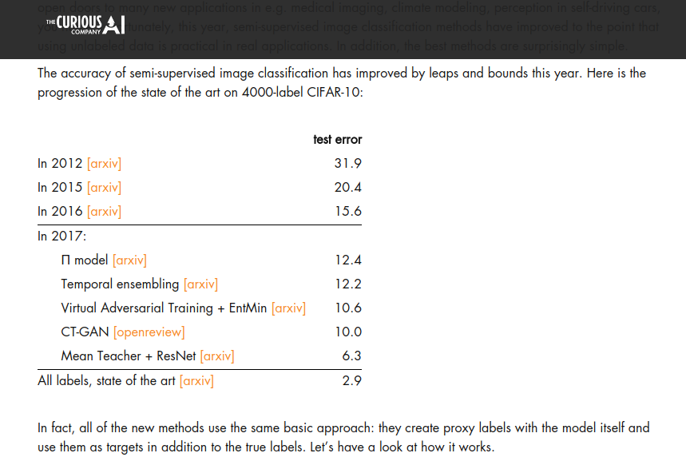
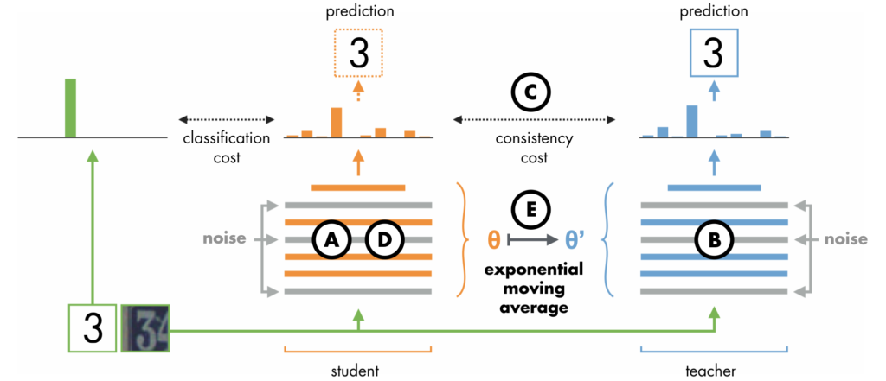

# Mean teachers are better role models: Weight-averaged consistency targets improve semi-supervised deep learning results
### by Antti Tarvainen (Curious AI), Harri Valpola (CuriousAI)
### ArXiv:1703, NIPS 2017

This paper proposes a new semi-supervised learning model by incorporating the *Student-Teacher* models, and using the exponential mean (=average) of the student model weights as the teacher model, hence the name "Mean Teacher."

Importantly, the accompanied [blog post](https://thecuriousaicompany.com/mean-teacher/) and the [code (+tips for choosing hyperparameters and other tuning)](https://github.com/CuriousAI/mean-teacher) is awesome. It explains recent advancements in semi-supervised classification methods very well. I really like this kind of well-organized, well-surveyed, well-explained materials. It makes life much much easier.

## Approach

Detailed approach is organized very nicely in the [blog post](https://thecuriousaicompany.com/mean-teacher/). Below is my attempt to summarize it more compactly:

* Entropy Minimization ([2004](https://papers.nips.cc/paper/2740-semi-supervised-learning-by-entropy-minimization)) : pull the unlabeld sample predictions to the *nearest* class, which is the same as just changing the prediction confidence.
* Student-Teacher models : either make the student task harder, or the teacher task easier to learn something useful
  * Harder student task
    * $\Gamma$ version of Ladder Networks ([2015](https://arxiv.org/abs/1507.02672)) : make a perturbed input and train it to mimic the clean prediction
    * Virtual Adversarial Training ([2015](https://arxiv.org/abs/1507.00677), [2017](https://arxiv.org/abs/1704.03976)) : make an *adversarial* sample for a pertubed input
  * Easier teacher task
    * Pseudo-Ensemble Agreement ([2014](https://arxiv.org/abs/1412.4864)) : ensemble over noises, use an ensemble of two perturbed predictions as the *clean* prediction
    * $\Pi$ Model ([2017](https://arxiv.org/abs/1610.02242)) : same as above
    * CT-GAN ([2017](https://openreview.net/forum?id=SJx9GQb0-)) : same as above
    * Temporal Ensemble ([2017](https://arxiv.org/abs/1610.02242)) : in addition, ensemble over models - exponential moving average on the student model predictions, and use it as the teacher model prediction (which then pulls the student model again)
    * **Mean Teacher** ([2017](https://arxiv.org/abs/1703.01780)) : exponential moving average on the student model **weights** instead of on predictions. This allows online learning updates, better memory usage, and better performance.
    

## Experiments

Settings:
* CIFAR-10 with { 1000, 2000, 4000, 50000 } labels (out of 50000)
* SVHN with { 250, 500, 1000, 73275 } labels (out of 73275)
  * 500 labels with { 100000, 500000 } extra *unlabeled* images are also experimented
* ImageNet 2012 with 128000 labels (10%, out of 1280000)

## My Thoughts

* Self-ensembling techniques seems to show surprisingly promising results... But why??
* Can this averaging of model weights ([Polyak averaging](https://www.researchgate.net/publication/236736831_Acceleration_of_Stochastic_Approximation_by_Averaging)) benefit also in applications other than semi-supervised classification setting? Need to do some experiments.
* Student-Teacher models are very prominent these days. Seems like it somehow regularizes(?) models well and boosts generalization performance. We should all think about whether it will also help in our own problems of interest.

---
> Jan. 10, 2018
> Note by Myungsub