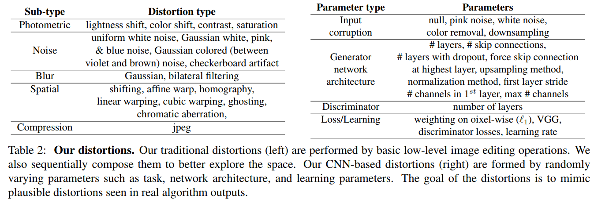
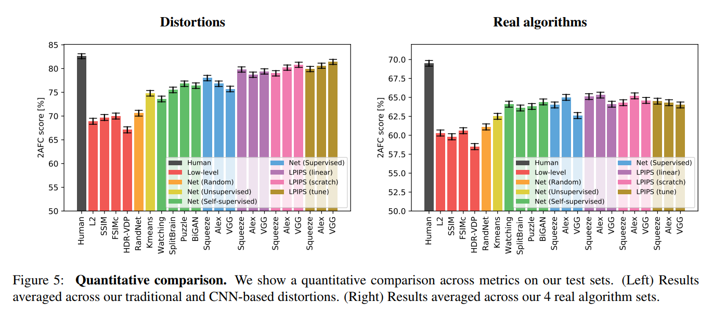

# The Unreasonable Effectiveness of Deep Features as a Perceptual Metric
### by Richard Zhang, Phillip Isola, Alexei A. Efros(Berkeley), Eli Shechtman, Oliver Wang(Adobe)
### ArXiv:1801

The author group is well known as [CycleGan](https://junyanz.github.io/CycleGAN/), and has been researching image colorization, image to image translation.
Much of this work was done while the first author, Richard Zhang, was an intern at Adobe Research.

This paper proposes a new Full Reference Image Quality Assessment(FR-IQA) dataset of perceptual human judgements, orders of magnitude larger than previous datasets.
The dataset is proposed to answer questions about "perceptual loss", which has been remarkably useful as a training loss for image synthesis, i.e., the pretrained VGG network.
They systematically evaluate deep features across different architectures and tasks and compare them with classic metric, and find that deep features outperforms all previous metrics by huge margin.

## Approach

### Dataset
Their main contribution is introducing a large-scale, highly vaired, FR-IQA dataset, containing 484k human judgements.
Comparison with prior works as followed,

### Similarity Measurements
The first question about perceptual loss could be how to generalize perceptual preference of human.
They socre not only similarity measurements from networks but multiple responses from human using 2AFC.

* For human
    * Two alternative forced choice(2AFC) : asking which of two distortions is more similar to a reference.
    * Just noticeable difference(JND) : asking whether two consecutive images are the same or different.

* For network
    * Learned perceptual image patch similarity(LPIPS) : 

* 2AFC score : computing agreement of an algorithm with all of the judgments.

### Distortions

* Traditional distortion & CNN-based distortion

* Distortions from real algorithms : super-resolution, frame interpolation, video deblurring, and colorization.

## Quantitative Comperision
The proposed metric LPIPS is much closer to the human response which is maximum score of 2AFC.

## My Thoughts
* The concept of the paper is simple and has a clear contribution, proposing a perceptual metric on a large dataset.

* However, the detail of the paper is written confusing for me. They atteched a bunch of variations about network architectures, training methods, distortions, and experiments with weakly reasonable assumptions, such as the mehtod of computing distance from a network.

---
> Jan. 29, 2018
> Note by Heewon