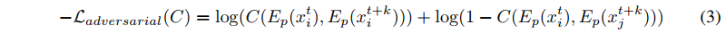

# Unsupervised Learning of Disentangled Representations from Video
### by Emily Denton (NYU), Vighnesh Birodkar (NYU)
### ArXiv:1705, NIPS 2017

This paper shows a very neat training procedure to factorize the video representation into **time-varying** and **time-independent** components. The authors refer to these as *pose* and *content* of a video.

## Approach

Two separate encoders produce distinct feature representations of content and pose for each frame. They are trained to correctly reconstruct the future frame at time *t+k* by combining the content representation $x^t$ and the pose representation $x^{t+k}$ and decoding to predict the pixel values. Plus, they introduce new adversarial losses to enforce disentanglements.

* Reconstruction loss : standard per-pixel $l_2$ loss between the predicted future frame $\tilde{x}^{t+k}$ and the actual frame $x^{t+k}$ for some random frame offset $k \in [0, K]$.

* Similarity Loss : to ensure the content encoder extracts time-invariant representations, content features $h_c^t$ and $h_c^{t+k}$ should be almost the same.

* Adversarial Loss
  * Scene discriminator : attempt to classify the pose feature pairs whether they come from the same/different video. Goal is to *not* to be able to discriminate, thereby *maximizing* the uncertainty.
  
  

All of it is summarized in Figure 1.

Generation of future frames is done by recurrently predicting the latent pose vector $h_p$ through an LSTM model (trained separately from the main model) conditioned on the content vector $h_c$.

## Experiments

Several experiments:
* The ability to cleanly factorize into content and pose components
  * MNIST, NORB, SUNCG datasets are used to demonstrate this.
* Forward prediction of video frames
  * KTH Action Dataset used.
* Using the pose/content features for classification tasks
  * NORB, KTH dataset results reported.

## My Thoughts

* It is one of my personal favorite NIPS 2017 paper. Neat design of losses and the architecture - very [Alchemy](https://www.youtube.com/watch?v=Qi1Yry33TQE)-style paper.
* It seems like the current only way of generating long-term future frames in a video is to first factorize the representation well, use the encoded features to predict the future frame vector, and then generate the corresponding realistic frame. I guess I should also have to follow this scheme... unless some other good idea strikes my head.
* Some random ideas :
  * Maybe adding attention mechanisms to the LSTM models might get better future frame generations? - this might be helpful when we want to generate a long-term video with totally different scene replacements or etc.
  * I think there should be a better adversarial loss, though not able to formulate something right away.
  * How can we extend it to generate a more *realistic* videos?

---
> Note by Myungsub